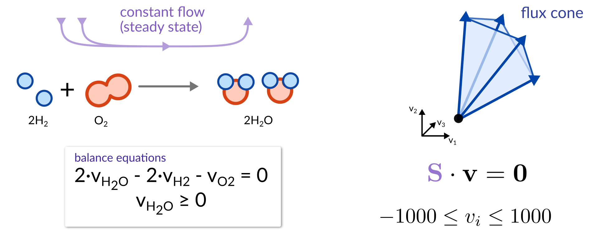
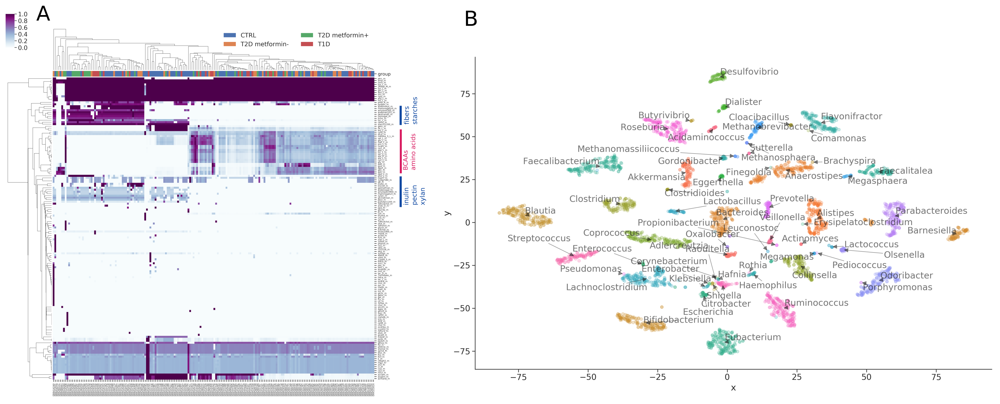

<!-- .slide: data-background="assets/isb/microbes-midnight.png" class="dark" -->

# A Deep-Dive into Microbe-Centric Metabolic Modeling

### Christian Diener, Gibbons Lab

*Workshop B*

 

<a href="https://creativecommons.org/licenses/by-nc/4.0/"><i class="fa fa-bullhorn"></i>CC-BY-SA</a>
<a href="https://gibbons.isbscience.org/"><i class="fa fa-globe"></i>gibbons.isbscience.org</a>
<a href="https://github.com/gibbons-lab"><i class="fa fa-github"></i>gibbons-lab</a>
<a href="https://twitter.com/thaasophobia"><i class="fa fa-twitter"></i>@thaasophobia</a>

---

<!-- .slide: data-background="var(--primary)" class="dark" -->

## Outline :clock:

1. Flux Balance Analysis
2. Metabolic reconstruction
3. Break
4. Metagenome-scale metabolic modeling
5. Introduction to the hands-on setup
6. Hands-on exercise
7. Wrap-up

---

# Functional analyses

Tries to predict what the microbiome *does* from sequencing data.

Uses gene/transcript/protein/metabolite abundances (metagenomics, metatranscriptomics, proteomics or metabolomics).

Gene content yields metabolic *capacity* or *potential*.

---

<!-- .slide: data-background="var(--secondary)" class="dark" -->

# Genes and metabolite concentrations are cool but not what you really care about*

hot take :fire:

---

## Fluxes

<video width="45%" autoplay loop>
  <source src="assets/fluxes.mp4" type="video/mp4">
</video>

video courtesy of [S. Nayyak](https://twitter.com/Na_y_ak) and [J. Iwasa](https://twitter.com/janetiwasa)

---

<!-- .slide: data-background="var(--secondary)" class="dark" -->

# Flux Balance Analysis (FBA)

Can we infer the most likely fluxes in a biological system?

---

## The flux cone

---

The goal of FBA is to *reduce* the flux space to a *biologically relevant* one.

---

## Genome-scale metabolic modeling

---

## Selecting biologically relevant fluxes via parsimony

Reproduces experimental fluxes in <i>E. coli</i> [very well](https://dx.doi.org/10.1038%2Fmsb.2010.47).

Bacteria do not like to produce more enzymes than necessary.

---

<!-- .slide: data-background="var(--secondary)" class="dark" -->

# Metabolic reconstruction

How do we get a genome-scale metabolic model in the first place?

---

## General strategy

---

---

## Curated reconstructions

*Curation* is the process of adding or removing reactions to the model based on experimental evidence.

 

#### Basic

- structural quality ([MEMOTE](https://doi.org/10.1038/s41587-020-0446-y))
- gap-filling for a standard growth medium (LB, M9, ...)

  

#### Stringent

- growth on various carbon sources ("likes maltose but not glucose")
- known metabolic conversion ("produces indole from tryptophan")
- strain-specific biomass composition

---

|                | [carveME](https://doi.org/10.1093/nar/gky537) | [ModelSEED/Kbase](https://doi.org/10.1038/nbt.1672) | [gapseq](https://doi.org/10.1186/s13059-021-02295-1) |
|----------------|-----------|-----------------|------------|
| speed          | :smile:   | :pensive:       | :cry:      |
| sensitivity    | :pensive: | :cry:           | :smile:    |
| model quality  | :smile:   | :pensive:       | :smile:    |
| free solver    | :cry:     | :pensive:       | :smile:    |
| easy to use    | :pensive: | :smile:         | :cry:      |
| many media     | :pensive: | :smile:         | :pensive:* |
| SBML standard  | :smile:   | :smile:         | :smile:    |

## Limitations

- unknown enzymes/pathways are never captured
- dependency on universal model
- hard to formulate growth media
- growth objective may not always apply (toxicity, human tissues)

---

<!-- .slide: data-background="var(--secondary)" class="dark" -->

# Metagenome-scale metabolic modeling

---

<!-- .slide: data-background="var(--primary)" class="dark" -->

## Community-wide growth is hard :cry:

In a single genome-scale model we only have a single growth rate $\mu$. In a microbial community
we have several $\mu_i$ and a community growth rate

$$
\mu_c = \sum_i a_i\cdot\mu_i
$$

Why is this so hard? Can't we just maximize the community growth rate? Well...

---

*Cooperative Tradeoff FBA* combines flux balance analysis with an ecological model
constraining the growth rates.

---

## When 2 leads to infinity...

---

## But does it work?

https://doi.org/10.1128/mSystems.00606-19

---

Easy peasy. What's taking so long then?

 

Well, metagenome-scale models are slightly larger... :sweat:

---

69,441 reactions / 46,883 metabolites / 292,699 connections

---

## Your turn

Check out how to use MICOM for a "n-of-1" analysis.

----

## The niche space

----

## Metabolic connections with disease

----

<!-- .slide: data-background="var(--primary)" class="dark" -->

We observed that the *overall production flux* $v_p = \sum a_i\cdot v_i^{ex}$
is most directly related to the phenotype.

This is the flux the *intestinal cells* can interact with.

---

<!-- .slide: data-background="var(--primary)" class="dark" -->

### And we are done :clap:

# Thanks!
